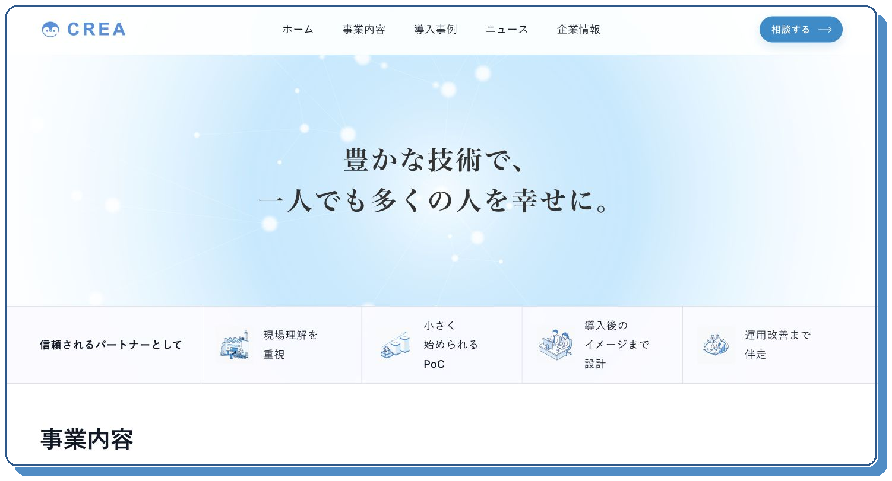
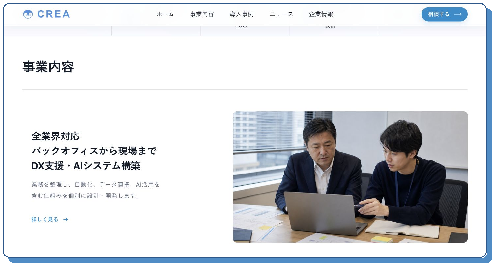
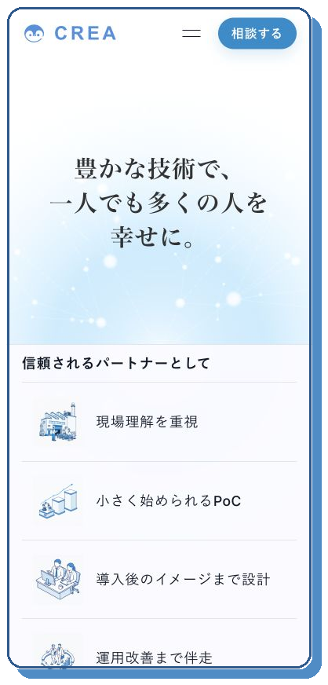

# CREA Corporate Website

> This repository is a portfolio case study. The production source code and internal project materials are private.

[Live Website](https://tech-crea.com/)

## Overview

株式会社CREAの事業内容と支援姿勢を伝えるコーポレートサイトです。

DX支援・AIシステム構築、製造業向け支援、ファクトリーオートメーション・フィジカルAIなど、複数の事業領域を初めて訪れた方にも把握しやすい構成に整理しました。企業サイトとしての信頼感を保ちながら、相談までの導線が自然につながることを重視しています。

## My Role

- 情報設計
- Webデザイン
- フロントエンド実装
- バックエンド
- レスポンシブ対応

情報設計からデザイン、フロントエンド、バックエンドまで担当しました。

## Design & Delivery

### 情報を短時間で理解できる構成

支援領域を大きな単位に整理し、見出し・説明・ビジュアルを組み合わせて、訪問者が自分に関係するサービスを見つけやすい構成にしました。

### 信頼感と相談しやすさの両立

余白、タイポグラフィ、落ち着いた配色で信頼感をつくりながら、各ページから相談導線へ自然に移れるよう設計しました。

### Responsive Design

デスクトップとスマートフォンの双方で、見出しの階層、事業内容、行動導線が崩れず読み進められるよう調整しています。

## Screenshots

### First View

企業の理念と支援姿勢を、最初の画面で端的に伝えています。

### Business

複数の事業領域を、説明とビジュアルの組み合わせで整理しています。

### Mobile

小さな画面でも、理念から支援の特徴まで自然な順序で確認できます。

## Repository Notice

本ケーススタディで公開しているのは、公開サイトへのリンク、制作概要、担当範囲、公開ページのスクリーンショットのみです。プロダクションコード、認証情報、管理画面、内部設計、アクセス解析、顧客情報、非公開資料は掲載していません。
