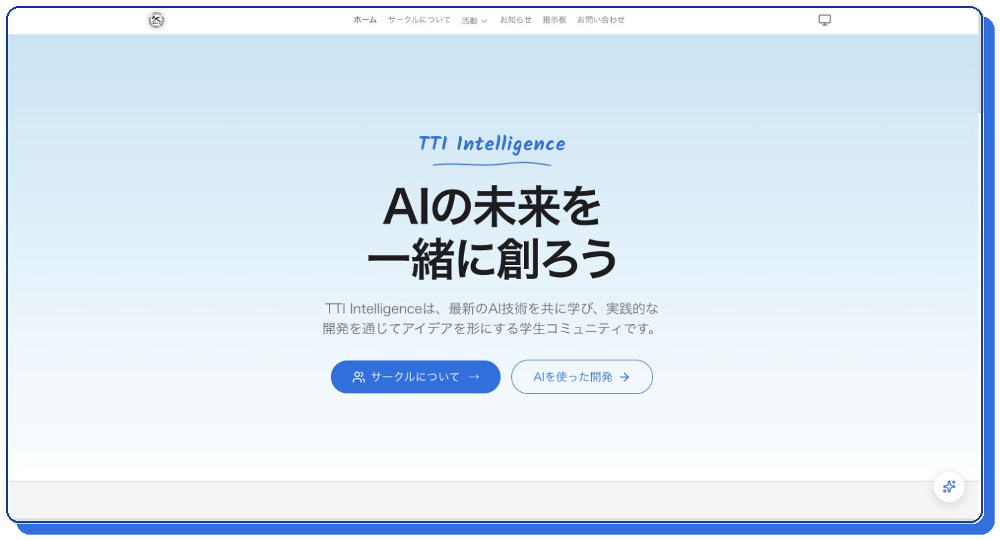
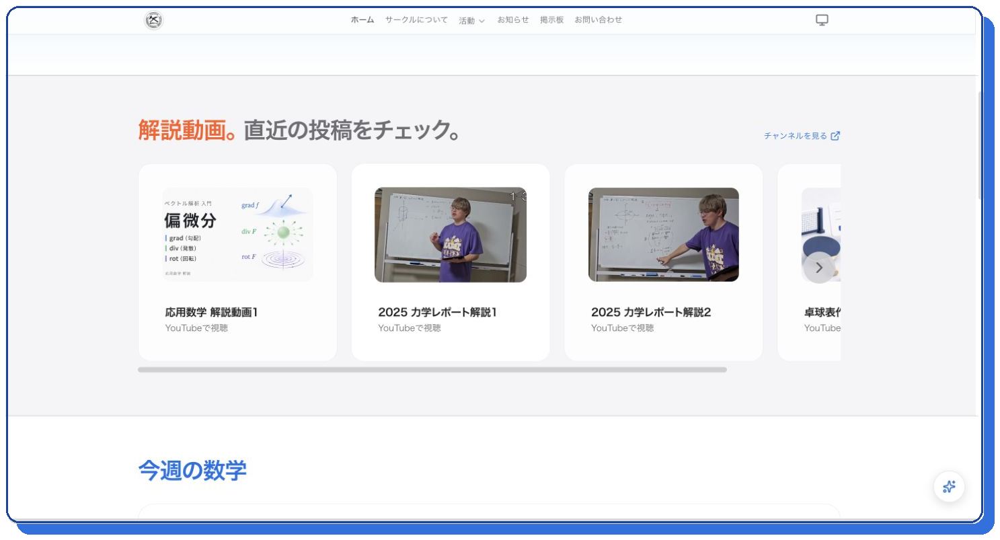
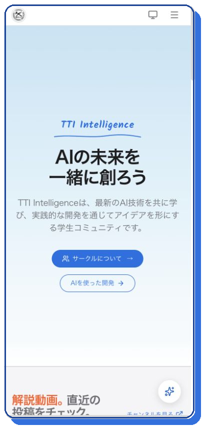
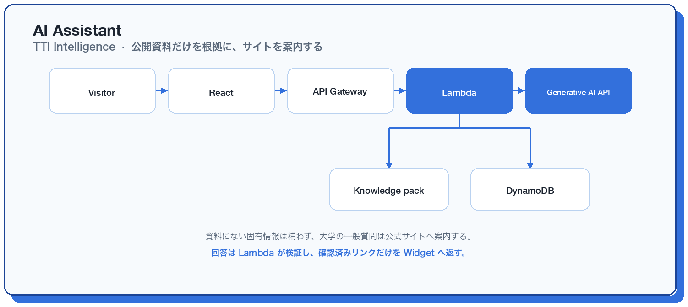

# TTI Intelligence

[Website](https://tti-intel.com/) · [Source Code](https://github.com/haruhito0314/tti-intel-web)

## Overview

TTI Intelligenceは、最新のAI技術を共に学び、実践的な開発を通じてアイデアを形にする学生コミュニティです。

コミュニティ紹介だけでなく、解説動画、数学コンテンツ、お知らせ、掲示板、アプリ紹介、サイト内AI Assistantなど、活動と開発成果を継続的に公開できるWebサイトとして運用しています。

## My Role

- サイト企画・情報設計
- UI / UXデザイン
- React / TypeScriptによるフロントエンド開発
- API・バックエンド開発
- サイト内AI Assistantの開発
- AWS CDKによるインフラ構築
- テスト、デプロイ、継続運用

企画から設計、実装、公開、運用まで一貫して担当しています。

## Features

- コミュニティと活動内容の紹介
- 解説動画・数学コンテンツの掲載
- ニュース・掲示板・お問い合わせ
- 公開コンテンツを案内するサイト内AI Assistant
- デスクトップ・スマートフォンへのレスポンシブ対応
- AWS Lambda、DynamoDB、Cognito、S3を利用したバックエンドと管理機能

## Tech Stack

- React 19 / TypeScript / Vite
- Tailwind CSS / GSAP
- AWS CDK / Lambda / API Gateway
- DynamoDB / Cognito / S3 / Secrets Manager
- Vitest / ESLint

## Screenshots

### First View

コミュニティの目的と主要な導線を、最初の画面に集約しています。

### Activities

解説動画や数学コンテンツなど、継続的な活動が伝わる構成です。

### Mobile

スマートフォンでも主要メッセージと行動導線が明確に見えるよう調整しています。

### AI Assistant

## Links

- [Website](https://tti-intel.com/)
- [Source Code](https://github.com/haruhito0314/tti-intel-web)
- [Portfolio Index](../README.md)
